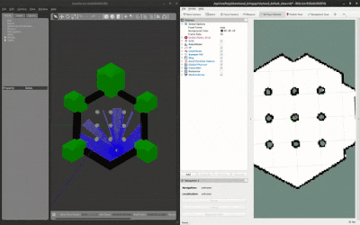

# ROS 2 humble Gazebo Simulation in docker
Run gazebo classic simulation with Turtlebot 3 with ROS 2 humble in a local docker container.



## Motivation
Simple simulation for testing purposes. 

## Installation
1. Check out all submodules with this repository (`git submodule init && git submodule update -r`)
1. Install docker. Make sure you have the right version for your graphic-card installed (e.g. [docker-nvidia2](https://docs.nvidia.com/datacenter/cloud-native/container-toolkit/install-guide.html#docker) for NVIDIA graphics cards)!
1. Install `terminator` using your systems package manager (e.g. `sudo apt install terminator`).

## Configuration
There's no further configuration needed, but you might want to take a look at these:
1. To run in an isolated environment the container use their own docker network called `turtlebot`. If you want to access it from the host network you might want to change to `network-mode: host` and remove the `turtlebot`-network entries.
1. Configure ROS_DOMAIN_ID (default 30) and TURTLEBOT3_MODEL (default burger) if you like to run multiple robots.

## General Usage
After you installed docker and terminator you can directly call the `./run.bash`-script, it starts the robot in the basic Turtlebot environment as well as everything that is needed for autonomous navigation and rviz2.

## Development
**Note that you don't need to run the build script, the image is pushed to docker hub, just run `docker-compose pull`!**

If you want to rebuild the docker-container and do not want to use the provided container from docker hub you can force a rebuild it by running `./build.bash` in the subfolder.

### Custom ros2-commands from the host system
If you like to run custom ROS commands you can do so by going into the `remote-pc`-folder and execute `./turtlebot.bash YOUR_ROS_COMMAND` like so:

```bash
cd remote-pc
./turtlebot.bash ros2 topic list
```

## Cleanup
When you close the terminator-window `docker-compose down` will be executed in the `remote_pc` and `simulated_turtlebot` subfolders to stop all remaining docker instances. Note that this might also stop other docker container you are running!


## Contributing

Please use the [issue tracker](https://github.com/brean/ros2-turtlebot3-gazebo-docker/issues) to submit bug reports and feature requests. Please use merge requests as described [here](/CONTRIBUTING.md) to add/adapt functionality. 

## License

This code is distributed under the [3-clause BSD license](https://opensource.org/licenses/BSD-3-Clause).

## Maintainer / Authors / Contributers

Andreas Bresser, andreas.bresser@dfki.de